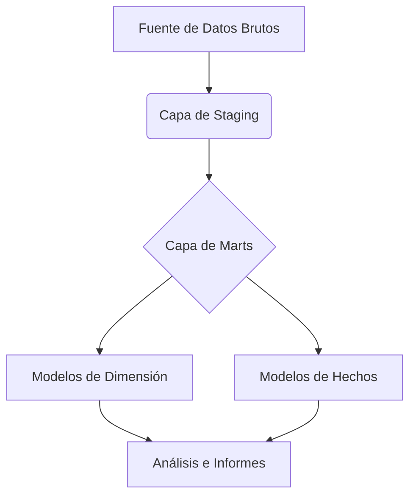
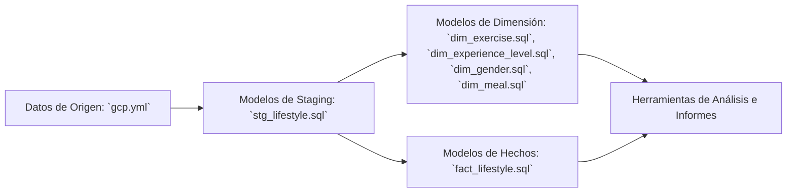

# Proyecto dbt Lifestyle

## Tabla de Contenidos
1.  [Descripción General del Proyecto](#1-descripción-general-del-proyecto) 🚀
2.  [Arquitectura](#2-arquitectura) 🏗️
3.  [Flujo de Datos](#3-flujo-de-datos) 🌊
4.  [Modelos de Datos](#4-modelos-de-datos) 📊
    *   [Capa de Staging](#capa-de-staging)
    *   [Capa de Marts](#capa-de-marts)
5.  [Macros](#5-macros) ⚙️
6.  [Paquetes](#6-paquetes) 📦
7.  [Pruebas](#7-pruebas) ✅
8.  [Configuración Reproducible](#8-configuración-reproducible) 🛠️
9.  [Métricas y Definiciones](#9-métricas-y-definiciones) 📈

## 1. Descripción General del Proyecto 🚀
Este proyecto dbt está diseñado para transformar datos brutos de estilo de vida en un formato estructurado y analizable. Utiliza dbt (data build tool) para definir, gestionar y documentar las transformaciones de datos, asegurando la calidad y consistencia de los mismos. El proyecto sigue un enfoque por capas, moviendo los datos desde las fuentes brutas a través de una capa de staging hasta una capa de mart refinada, lista para informes y análisis.

## 2. Arquitectura 🏗️
La arquitectura del proyecto se basa en las mejores prácticas de dbt, organizando los modelos en capas distintas para promover la modularidad, la reutilización y la mantenibilidad.



**Capas:**
*   **Capa de Staging (`stg_` models):** Esta capa contiene modelos que seleccionan directamente de los datos brutos de origen. Su propósito principal es limpiar, estandarizar y realizar transformaciones ligeras (por ejemplo, renombrar columnas, convertir tipos de datos) sin aplicar lógica de negocio compleja. Cada modelo de staging suele corresponder a una única tabla de origen.
*   **Capa de Marts (`dim_` y `fact_` models):** Esta capa contiene la lógica de negocio central y los datos agregados, estructurados en esquemas de estrella al estilo Kimball.
    *   **Modelos de Dimensión (`dim_`):** Estos modelos representan el "quién, qué, dónde, cuándo, por qué" del negocio. Contienen atributos descriptivos que proporcionan contexto a los hechos. Ejemplos incluyen `dim_exercise`, `dim_meal`, `dim_gender`, `dim_experience_level`.
    *   **Modelos de Hechos (`fact_`):** Estos modelos representan el "cuánto" o "cuántos" del negocio. Contienen datos medibles y cuantitativos, y claves foráneas a las tablas de dimensión.

## 3. Flujo de Datos 🌊
El flujo de datos dentro de este proyecto dbt es secuencial y lógico, asegurando la integridad de los datos y la transformación de manera estructurada.



## 4. Modelos de Datos 📊

### Capa de Staging
*   `stg_lifestyle.sql`: Limpia y prepara los datos brutos de estilo de vida de la fuente. Este modelo renombra columnas, convierte tipos de datos y maneja problemas básicos de calidad de datos.

### Capa de Marts

#### Modelos de Dimensión
*   `dim_exercise.sql`: Crea una tabla de dimensión para los tipos de ejercicio, incluyendo identificadores únicos y atributos descriptivos.
*   `dim_experience_level.sql`: Crea una tabla de dimensión para los niveles de experiencia, proporcionando contexto para la competencia del usuario.
*   `dim_gender.sql`: Crea una tabla de dimensión para el género, utilizada para el análisis demográfico.
*   `dim_meal.sql`: Crea una tabla de dimensión para los tipos de comida, categorizando la información dietética.

#### Modelos de Hechos
*   `fact_lifestyle.sql`: (Asumido, basado en modelos de dimensión) Este modelo combinaría típicamente las claves de dimensión con las métricas medibles del modelo `stg_lifestyle` para crear una tabla de hechos central para el análisis.

## 5. Macros ⚙️
Las macros en dbt son plantillas Jinja que permiten la reutilización de código y la generación dinámica de SQL. Este proyecto utiliza macros personalizadas para agilizar el desarrollo.

*   `generate_dimension.sql`: Esta macro está diseñada para automatizar la creación de tablas de dimensión. Toma un modelo de origen y una lista de columnas para generar una tabla de dimensión con identificadores únicos y atributos descriptivos. Esto promueve la consistencia y reduce el código repetitivo para la creación de dimensiones.

## 6. Paquetes 📦
Este proyecto aprovecha los siguientes paquetes de dbt para mejorar la funcionalidad y adherirse a las mejores prácticas:

*   **`dbt-labs/dbt_utils` (Versión 1.3.1):** Una colección de macros y utilidades que simplifican las tareas comunes de transformación de datos. Proporciona funciones para:
    *   **Compatibilidad entre bases de datos:** Macros que funcionan en diferentes plataformas de bases de datos.
    *   **Generación de SQL:** Macros de ayuda para generar fragmentos de SQL (por ejemplo, `union_relations`, `star`).
    *   **Auditoría y pruebas:** Macros para comprobaciones y aserciones de calidad de datos.

*   **`metaplane/dbt_expectations` (Versión 0.10.9):** Este paquete proporciona un conjunto de pruebas de calidad de datos inspiradas en `Great Expectations`. Permite definir expectativas sobre los datos, como:
    *   **Pruebas a nivel de columna:** `expect_column_to_exist`, `expect_column_values_to_be_unique`, `expect_column_values_to_not_be_null`.
    *   **Pruebas a nivel de tabla:** `expect_table_row_count_to_be_between`.
    Estas pruebas ayudan a garantizar la fiabilidad y precisión de los datos durante todo el proceso de transformación.

## 7. Pruebas ✅
La calidad de los datos es primordial. Este proyecto incluye varias pruebas para garantizar la integridad y validez de los datos transformados.

*   `assert_stg_lifestyle_is_fresh.sql`: Esta prueba afirma que el modelo `stg_lifestyle` está actualizado, típicamente verificando la frescura de los datos de origen subyacentes. Esto ayuda a identificar posibles retrasos o problemas en la ingesta de datos.

## 8. Configuración Reproducible 🛠️

Para configurar y ejecutar este proyecto dbt, siga estos pasos:

### Prerrequisitos
*   dbt Core instalado (consulte la [documentación de dbt](https://docs.getdbt.com/docs/introduction) para obtener instrucciones de instalación).
*   Una base de datos o almacén de datos compatible (por ejemplo, BigQuery, Snowflake, Redshift).
*   Un archivo `profiles.yml` configurado para conectar dbt a su almacén de datos. Un ejemplo de `profiles.yml` podría ser el siguiente (reemplace con sus credenciales reales):

    ```yaml
    lifestyledbt:
      target: dev
      outputs:
        dev:
          type: bigquery
          method: service-account
          project: [su_id_proyecto_gcp]
          dataset: dbt_dev
          threads: 4
          keyfile: [ruta_a_su_archivo_de_clave_de_cuenta_de_servicio.json]
          location: US
    ```

### Instalación

1.  **Clonar el repositorio:**
    ```bash
    https://github.com/J-Lopez-IICG/LifeStyle-DBT.git
    cd lifestyle-dbt
    ```

2.  **Instalar paquetes dbt:**
    ```bash
    dbt deps
    ```
    Este comando descargará e instalará los paquetes listados en `packages.yml`.

3.  **Ejecutar modelos dbt:**
    ```bash
    dbt run
    ```
    Este comando ejecutará todos los modelos del proyecto, creando o actualizando tablas/vistas en su almacén de datos.

4.  **Ejecutar pruebas dbt:**
    ```bash
    dbt test
    ```
    Este comando ejecutará todas las pruebas definidas para validar la calidad de los datos.

5.  **Generar documentación dbt:**
    ```bash
    dbt docs generate
    dbt docs serve
    ```
    Esto generará un sitio web estático con la documentación de su proyecto dbt y lo servirá localmente.

## 9. Métricas y Definiciones 📈
Esta sección define las métricas clave y los términos comerciales utilizados dentro del proyecto.

*   **Puntuación de Actividad Diaria:** Una puntuación compuesta que refleja el compromiso general diario de un usuario y las actividades relacionadas con la salud. (Métrica de ejemplo)
*   **Índice de Diversidad de Comidas:** Una medida de la variedad de tipos de comidas consumidas por un usuario durante un período. (Métrica de ejemplo)
*   **Nivel de Intensidad del Ejercicio:** Categorización del ejercicio basada en el esfuerzo, por ejemplo, 'Bajo', 'Medio', 'Alto'. (Definición de ejemplo)
*   **Nivel de Experiencia:** Competencia o familiaridad del usuario con ciertas actividades, por ejemplo, 'Principiante', 'Intermedio', 'Avanzado'. (Definición de ejemplo)

---
